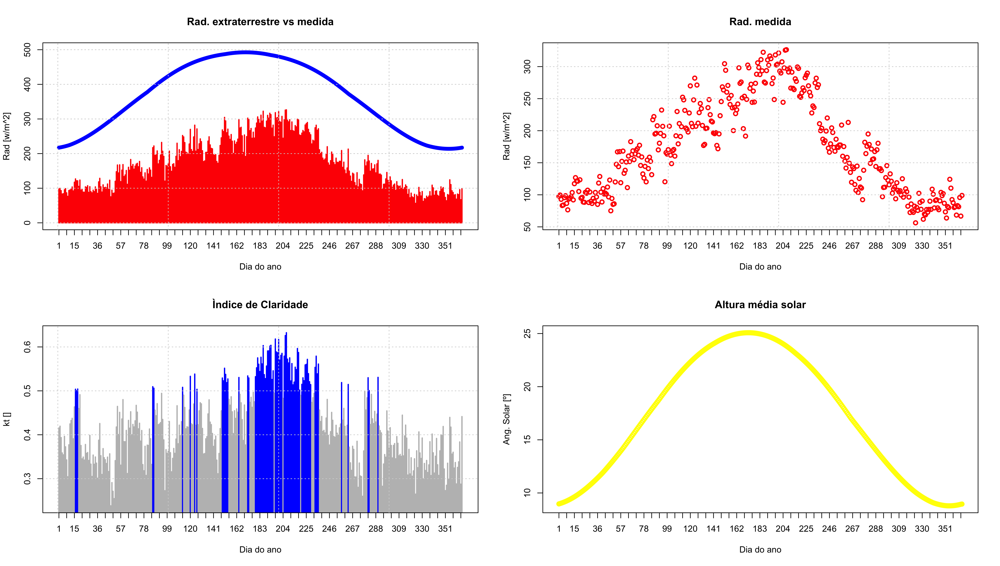

# ReSun & WRF output analysis
Measured data analysis and treatment, also calculates de clear sky index and sun angle

**To implement:**

* create interactive graphics

## Results:

**High quality graphics**

* Global horizontal radiation



## Usage:

* Run:
```r
make run
```

* kill application:
```r
make kill
```

Contacts:

<ricardo88faria@gmail.com>
